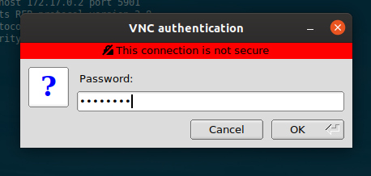
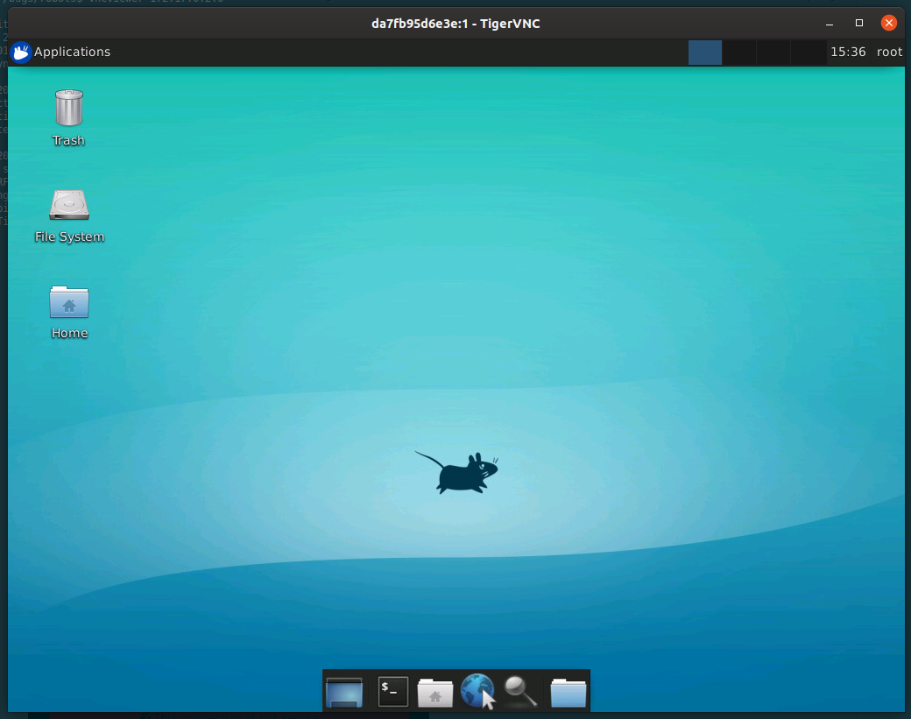
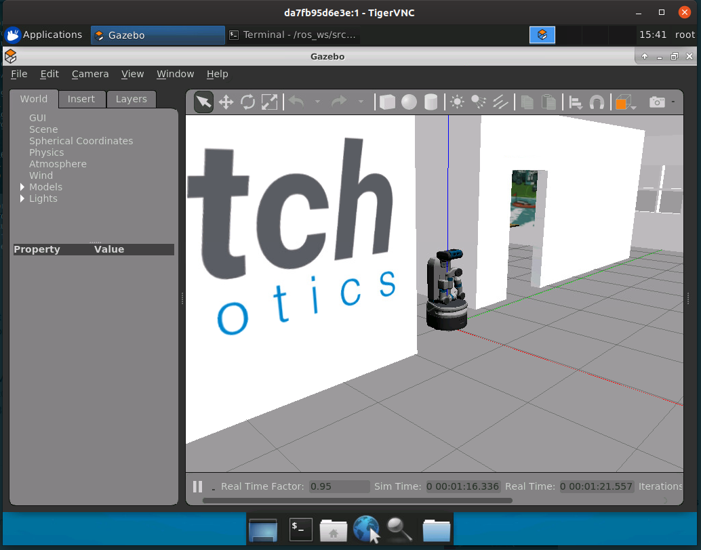

The Robot Cooperative
=====================

This repository is designed to make it easier for software engineering and
robotics researchers to interact with and experiment on robot software by
providing Docker images for a variety of open-source robots written for the
Robot Operating System.
Each Docker image is accompanied by example code and usage instructions,
and can be used to launch a robot in simulation using Gazebo,
and comes with VNC support for visualisation.
(For some images, we also provide GzWeb support as an experimental, alternative
means of visualisation.)

Getting Started
---------------

Prerequisites
.............

Docker
~~~~~~

Before you can use the images provided by the repo, make sure that `Docker
<https://www.docker.com/>`_ 17.05 or higher is installed on your machine.
Older versions of Docker do not support `multi-stage builds
<https://docs.docker.com/develop/develop-images/multistage-build/>`_ and will
be unable to build the images provided by this repository.
See the following for platform-specific instructions for installing Docker:

* `Installing Docker Engine on Ubuntu <https://docs.docker.com/engine/install/ubuntu>`_
* `Installing Docker Engine on Fedora <https://docs.docker.com/engine/install/fedora>`_
* `Install Docker Desktop on Mac <https://docs.docker.com/docker-for-mac/install>`_
* `Install Docker Desktop on Windows <https://docs.docker.com/docker-for-windows/install>`_

If using Linux, make sure to follow the
`post-installation instructions <https://docs.docker.com/engine/install/linux-postinstall>`_
(e.g., adding your user account to the `docker` group) to avoid common
issues (e.g., requiring `sudo` to run `docker` commands).

The images provided by this repository are known to work with
Mac OSX and several Linux distributions (Ubuntu, Arch), but are untested
on Windows.

VNC Viewer
~~~~~~~~~~

To enable visualiation (i.e., to be able to see the robot in simulation), you
will need to install a VNC viewer on your machine. There are many VNC viewers
available, and, for the most part, your choice of viewer should not dramatically
change the way that you interact with the images provided by this repository.

For the examples given below, all of which are performed using Ubuntu,
TigerVNC is used, which can be installed via the following:

.. code::

   # apt-get install tigervnc-viewer

Usage
-----

Below we provide general instructions for using the images provided by the
repository. Specific instructions on how to use an image for a particular robot
can be found in the associated directories for those robots.

Building the Docker image for a robot
.....................................

For most general purposes, Docker images should be built by providing the
corresponding directory name for the robot to :code:`make`.
Below is an example of how to build the image for Fetch.

.. code::

   $ make fetch

It is also possible to build the Docker image using :code:`docker build`
directly by supplying the appropriate build-time arguments. Please see the
:code:`Dockerfile` for instructions.

Using VNC to provide visualisation
..................................

To launch a VNC server from the inside the Docker container:

.. code::

   $ /startup-vnc.sh

To connect to the VNC server from the host machine, first obtain the IP address
of the container (e.g., :code:`172.17.0.2`), and use a VNC client to connect to
the server:

.. code::

   $ vncviewer 172.17.0.2:0

*Mac OS X:* If you are using Mac OS X, you cannot interact directly with a
container via its IP address. To get around this problem, you will need to
use port forwarding to forward the VNC port 5900 to the host, which can be
achieved by adding a :code:`-p 5900:5900` option to the :code:`docker run`
command used to launch the container, as shown below.

.. code::

   $ docker run -p 5900:5900 --rm -it name_of_image
   ...
   $ vncviewer 127.0.0.1

When prompted, login using the password :code:`password`

Assuming that everything goes to plan, you should see a desktop that looks something
like this:

You should continue to work inside the virtual desktop using your VNC client.
Below is an example of running the Fetch simulation inside the virtual desktop.

If you wish to modify the resolution of the virtual desktop, you can edit the
following line inside :code:`/etc/supervisor/conf.d/supervisord.conf` before
running :code:`/startup-vnc.sh`.

.. code::

   command=/usr/bin/Xvfb :1 -screen 0 1024x768x16
