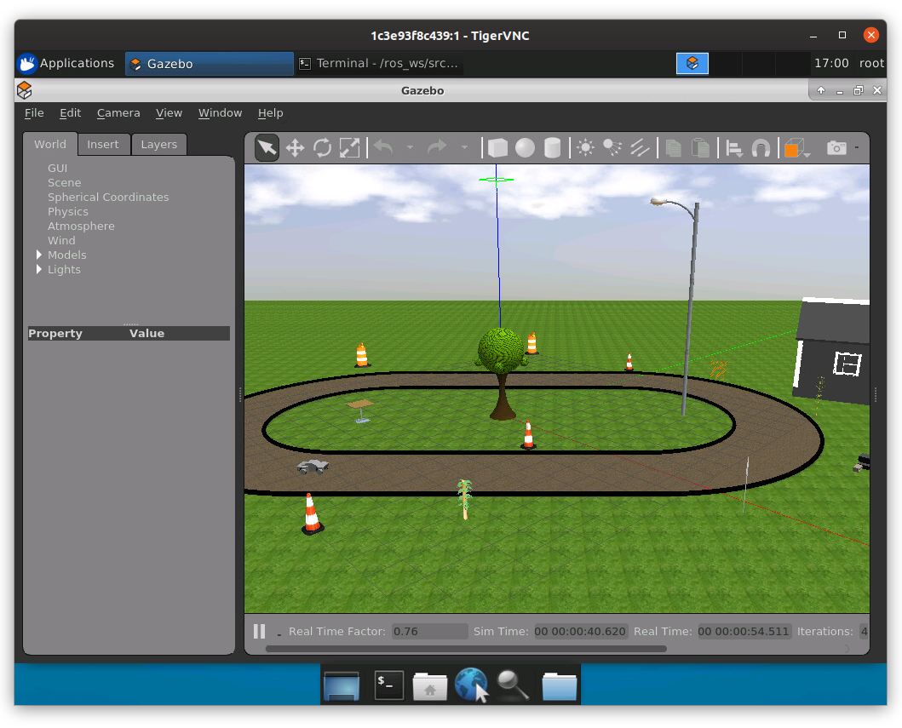

AutoRally
=========

.. image:: robot.jpg

Usage
-----

To launch the AutoRally platform inside a simulated world using Gazebo:

.. code::

   # source /ros_ws/src/autorally/autorally_util/setupEnvLocal.sh
   # roslaunch autorally_gazebo autoRallyTrackGazeboSim.launch

The simulated world should look something like that shown below:

References
----------

* https://github.com/AutoRally
* https://github.com/AutoRally/autorally/issues/84
* https://github.com/AutoRally/autorally/issues/88
* https://github.com/ethz-asl/rotors_simulator/issues/520
* http://wiki.ros.org/catkin/CMakeLists.txt
