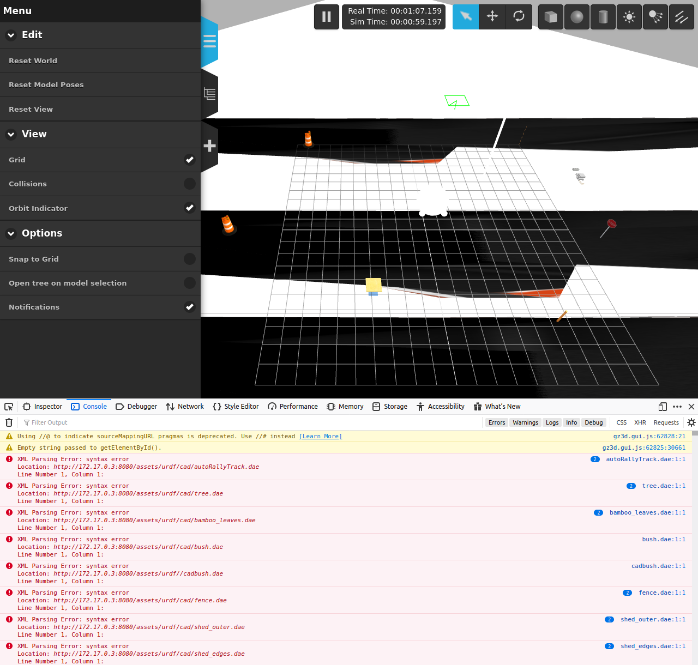

AutoRally
=========

.. image:: robot.jpg

Usage
-----

.. code::

   # source /ros_ws/src/autorally/autorally_util/setupEnvLocal.sh
   # roslaunch autorally_gazebo autoRallyTrackGazeboSim.launch

Status
------

The image now builds, but no :code:`postbuild.sh` script has been written yet
to add gzweb compatibility.

.. code::

   root@a498398b5021:/ros_ws# find . -name *.urdf*
   ./src/pointgrey_camera_driver/pointgrey_camera_description/urdf/test_flea3.urdf.xacro
   ./src/pointgrey_camera_driver/pointgrey_camera_description/urdf/test_bumblebee2.urdf.xacro
   ./src/pointgrey_camera_driver/pointgrey_camera_description/urdf/pointgrey_bumblebee2.urdf.xacro
   ./src/pointgrey_camera_driver/pointgrey_camera_description/urdf/pointgrey_flea3.urdf.xacro
   ./src/autorally/autorally_core/launch/robot.urdf
   ./src/autorally/autorally_description/urdf/jump30deg.urdf
   ./src/autorally/autorally_description/urdf/autoRallyPlatform.urdf.xacro
   ./src/autorally/autorally_description/urdf/jump26deg.urdf
   ./src/autorally/autorally_description/urdf/jump22deg.urdf
   ./src/autorally/autorally_description/urdf/jump18deg.urdf

References
----------

* https://github.com/AutoRally
* https://github.com/AutoRally/autorally/issues/84
* https://github.com/AutoRally/autorally/issues/88
* https://github.com/ethz-asl/rotors_simulator/issues/520
* http://wiki.ros.org/catkin/CMakeLists.txt
