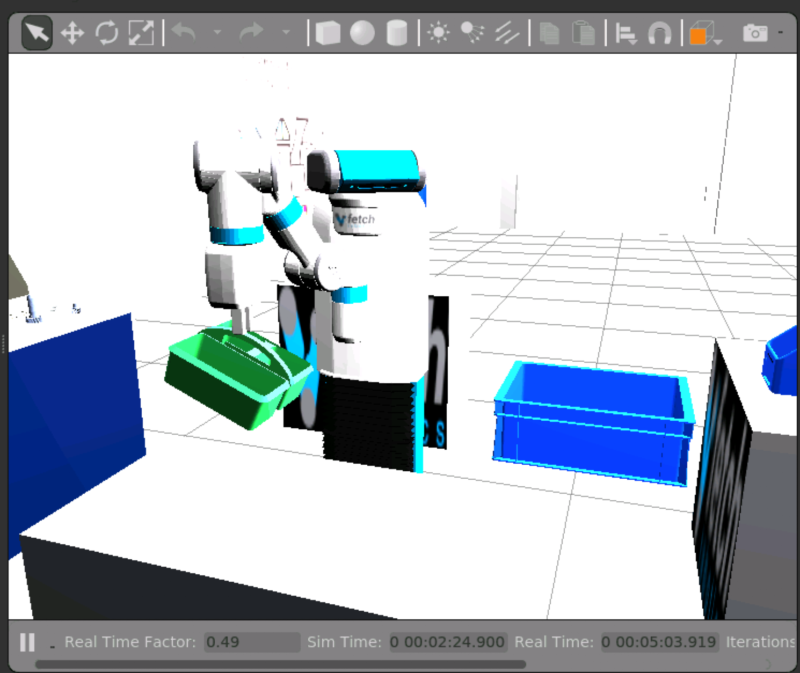

# FetchIt challenge

FetchIt challenge is a challenge on Fetch robots navigating
through a warehous environment and conducting a number of pick
and place actions. To be able to access the challenge's environment
you need to add these two rows to the `pkgs.rosinstall`:
```
- git:
    local-name: fetch_gazebo/fetch_simulation
    uri: https://github.com/fetchrobotics-gbp/fetch_gazebo-release.git
    version: release/melodic/fetch_simulation/0.9.2-1
- git:
    local-name: fetch_gazebo/fetchit_challenge
    uri: https://github.com/fetchrobotics-gbp/fetch_gazebo-release.git
    version: release/melodic/fetchit_challenge/0.9.2-1
```

### Open source competitors

Here is the source code of one of the competitors: https://github.com/uml-robotics/fetchit2019
I was able to run the challenge's environment and test some behaviors of the
robot such as [grasping the caddy](https://github.com/uml-robotics/fetchit2019/tree/master/caddy_manipulation)


I did not get it to actually pick things up. I think it is doable but needs modifications
to the code. I did not find a ready-to-go service call or executable to pick up
items.


Another open source project is https://github.com/GT-RAIL/derail-fetchit-public
I have not tried this yet.
