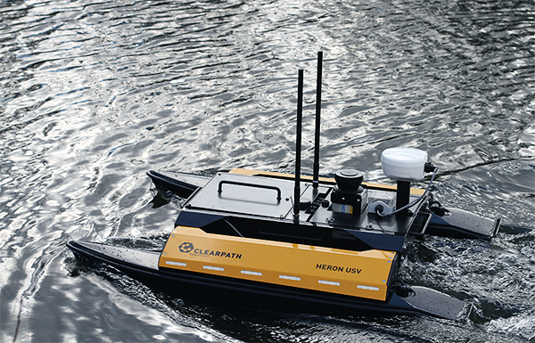

Heron
=====

Usage
-----

To launch the Heron robot in a Gazebo simulation:

.. code::

   # roslaunch heron_gazebo heron_world.launch

References
----------

* https://clearpathrobotics.com/heron-unmanned-surface-vessel
* https://github.com/heron
* https://github.com/heron/heron_simulator
* http://wiki.ros.org/Robots/Heron
* https://wiki.nps.edu/pages/viewpage.action?pageId=818282511
