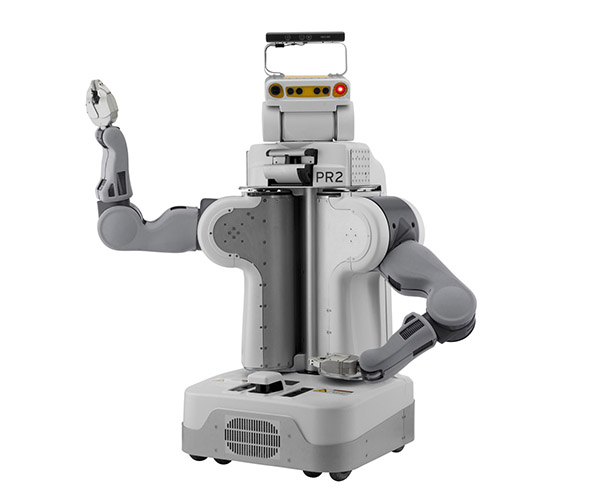

PR2
===

Structure
---------

* Models can be found in :code:`/ros_ws/src/pr2_common/pr2_description`

Notes
-----

The PR2 model is spawned in simulation via the following snippet in
:code:`/ros_ws/src/pr2_simulator/pr2_gazebo/launch/pr2_no_controllers.launch`.

.. code:: xml

  <!-- push robot_description to factory and spawn robot in gazebo -->
  <node name="spawn_pr2_model" pkg="gazebo_ros" type="spawn_model" args="$(optenv ROBOT_INITIAL_POSE) -unpause -urdf -param robot_description -model pr2 -ros_namespace /gazebo" respawn="false" output="screen" />

Where the contents of the URDF file are loaded onto the parameter server
via :code:`/ros_ws/src/pr2_common/pr2_description/robots/upload_pr2.launch`:

.. code:: xml

  <launch>
    <arg name="KINECT1" default="$(optenv KINECT1 false)" />
    <arg name="KINECT2" default="$(optenv KINECT2 false)" />
    <!-- send pr2 urdf to param server -->
    <group>
      <param name="robot_description" command="$(find xacro)/xacro '$(find pr2_description)/robots/pr2.urdf.xacro' --inorder KINECT1:=$(arg KINECT1) KINECT2:=$(arg KINECT2)" />
    </group>
  </launch>

To manually generate a pure URDF file for PR2, and to prepare it for GzWeb:

.. code::

  $ xacro /ros_ws/src/pr2_common/pr2_description/robots/pr2.urdf.xacro \
      --inorder KINECT1:=false KINECT2:=false > /ros_ws/src/pr2_common/pr2_description/robots/pr2.urdf
  $ sed -i "s#package://#model://#g" /ros_ws/src/pr2_common/pr2_description/robots/pr2.urdf

Usage
-----

To start up a minimal simulation of PR2 in an empty world:

.. code::

  $ roslaunch gazebo_ros empty_world.launch
  $ roslaunch pr2_gazebo pr2.launch
  $ cd /opt/gzweb && npm start

References
----------

* http://wiki.ros.org/Robots/PR2
* https://github.com/PR2
* https://bitbucket.org/osrf/gzweb/issues/78/spawning-the-pr2-robot-vs-inserting-the
