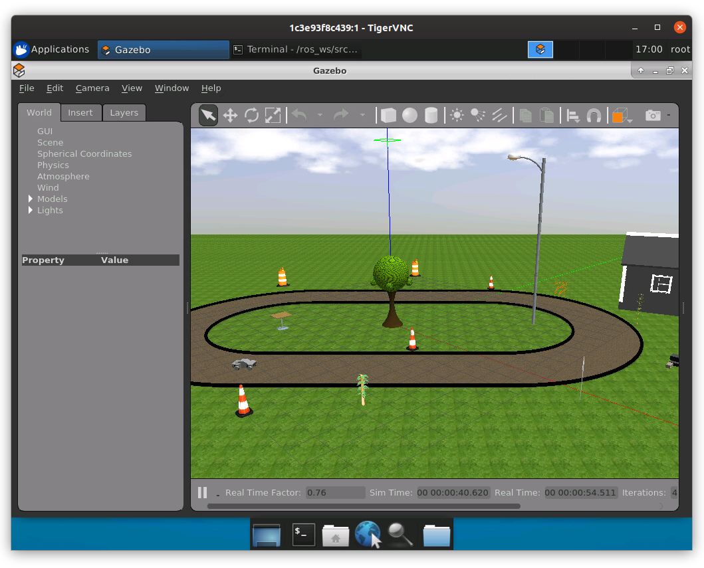
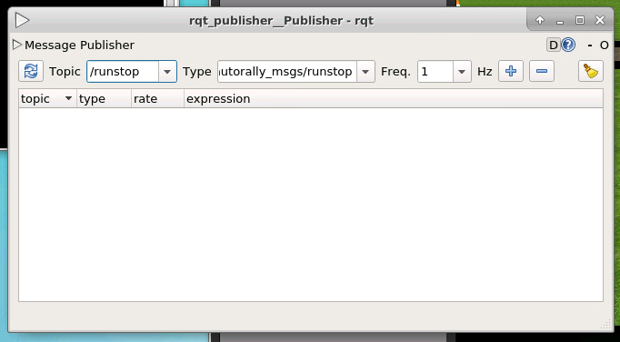
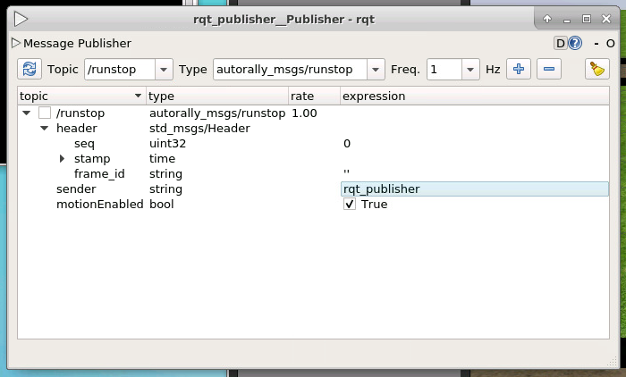
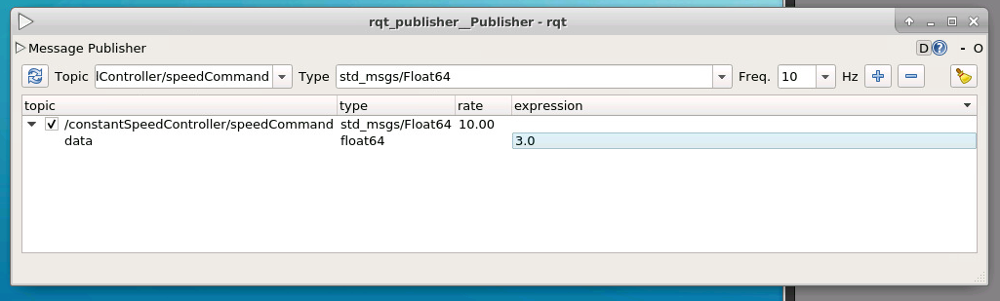

AutoRally
=========

.. image:: images/robot.jpg

Usage
-----

Normally users would interact with the simulator by using a gamepad to provide
inputs. Hitting one of several buttons on the gamepad causes a message to be
sent to the :code:`runstop` topic for the robot. The :code:`runstop` topic is
used to ensure that the robot only continues running while it continues to
receive messages on the :code:`runstop` topic at a regular interval. If the
robot fails to receive input from the :code:`runstop` topic for a certain
period of time, it will stop moving and become inactive.

For the purposes of conducting experiments on the self-driving capabilities of
the AutoRally platform, this behaviour isn't desirable. To enable autonomous
driving in the simulation, we must first modify the launch file that is used to
start the simulation by removing the line that is used to enable gamepad
input, as shown below.

.. code:: command

   $ sed -i "/joystickController.launch/d" /ros_ws/src/autorally/autorally_gazebo/launch/autoRallyTrackGazeboSim.launch

With the change in place, we will launch the AutoRally platform inside a
simulated world using Gazebo, as shown below. Before launching the simulator
via :code:`roslaunch`, we must source an additional script inside any shell
that we will be using to interact with AutoRally. Failing to do so will
result in errors, shown in the Troubleshooting section below.

.. code:: command

   $ . /ros_ws/src/autorally/autorally_util/setupEnvLocal.sh
   $ roslaunch autorally_gazebo autoRallyTrackGazeboSim.launch

After taking somewhere between 15 seconds to a minute to load,
the simulated world should look something like the image below.
Note that the _first_ time that the simulated world is launched will be
slower than any subsequent launches within the same container as Gazebo
performs certain preprocessing tasks before launching a world for the first
time. In the future, these preprocessing tasks will be baked into the
container image, but for now, we just have to make do with slightly slower
load-up times.

For self-driving experiments, we will use :code:`rqt_publisher` to publish
:code:`runstop` messages instead. (Note that :code:`rqt_publisher` is an
interactive application -- I will add instructions on how to programmatically
produce :code:`runstop` messages using :code:`roswire` soon.)
To launch :code:`rqt_publisher`, execute the code below.

.. code::

   $ rosrun rqt_publisher rqt_publisher

Using the rqt application, shown below, we will instruct rqt to publish a
message of type :code:`autorally_msgs/runstop` to the :code:`/runstop` topic
at a frequency of 1 Hz. After filling in the details in the appropriate
dropdown boxes, hit the plus button.

Once the regular message has been created, we need to edit the parameters of
that message. Click to reveal the details of the message, set the
:code:`sender` field to :code:`rqt_publisher`, the :code:`motionEnabled`
field to :code:`True`, and then tick the checkbox next to the topic name
to begin publishing the message.

To verify that motion is enabled, check the output of the :code:`runstop` topic
using :code:`rostopic` as shown below. Of most importance is that a message is
produced quickly after executing :code:`rostopic` and that
:code:`motionEnabled` is set to :code:`true`.

.. code:: command

   $ rostopic echo -n1 /runstop
   header:
     seq: 92
     stamp:
       secs: 0
       nsecs: 0
     frame_id: ''
   sender: "rqt_publisher"
   motionEnabled: True
   ---

Next, we need to start the waypoint follower:

.. code:: command

   $ roslaunch autorally_control waypointFollower.launch

Finally, we must start the constant speed controller and tell it the
desired speed of the robot.

.. code:: command

   $ roslaunch autorally_control constantSpeedController.launch

Again, we need to use :code:`rqt_publisher` to publish messages at a fixed
rate to the :code:`constantSpeedController/speedCommand` topic to inform
the controller of the desired speed of the robot. If this topic does not
receive messages, the robot will not move.
This time, we will publish a message of type :code:`std_msgs/Float64`
to :code:`constantSpeedController/speedCommand` at a rate of 10 Hz with
a value of :code:`3`, representing 3 m/s.

.. code:: command

   $ rosrun rqt_publisher rqt_publisher

Troubleshooting
---------------

**roslaunch fails to launch:**
If you an encounter an error such as the one below, it's likely that the
:code:`/ros_ws/src/autorally/autorally_util/setupEnvLocal.sh` script hasn't
been sourced in the shell from which the :code:`roslaunch` is being executed.

.. code:: command

   root@c59843ec76a3:/ros_ws/src/autorally/autorally_core/launch# roslaunch autorally_control constantSpeedController.launch
   ... logging to /root/.ros/log/a36b9790-75e9-11ea-b82c-0242ac110002/roslaunch-c59843ec76a3-2976.log
   Checking log directory for disk usage. This may take awhile.
   Press Ctrl-C to interrupt
   Done checking log file disk usage. Usage is <1GB.

   RLException: environment variable 'ROSLAUNCH_SSH_UNKNOWN' is not set
   The traceback for the exception was written to the log file

References
----------

* https://github.com/AutoRally
* https://github.com/AutoRally/autorally/issues/84
* https://github.com/AutoRally/autorally/issues/88
* https://github.com/ethz-asl/rotors_simulator/issues/520
* http://wiki.ros.org/catkin/CMakeLists.txt
