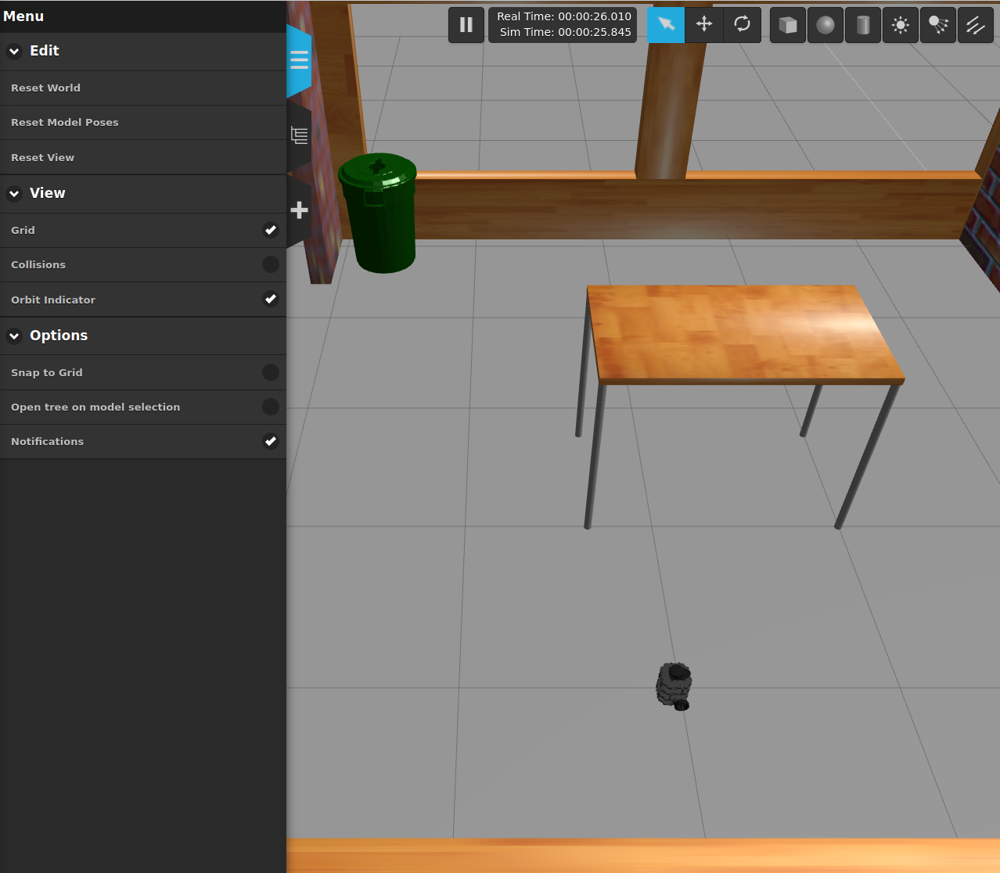
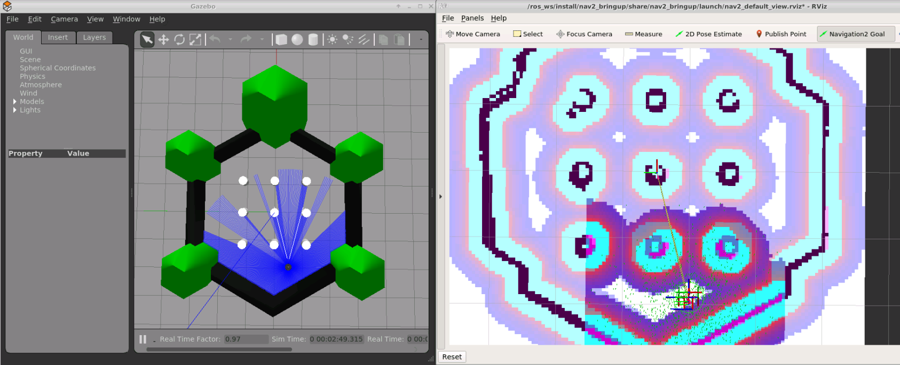

TurtleBot3
==========

.. image:: robot.png

Status
------

It works!

Usage
-----

Note that before running the simulation, the TurtleBot3 model that you wish
to use must be specified in the :code:`TURTLEBOT3_MODEL` environment variable.
The following models are supported: :code:`burger`, :code:`waffle`, and
:code:`waffle_pi`.

.. code::

   # export TURTLEBOT3_MODEL="burger"

After specifying the appropriate model, the TurtleBot can be launched in a
Gazebo simulation using the following command:

.. code::

   # roslaunch turtlebot3_gazebo turtlebot3_house.launch gui:=false

(Note that there are other simulated worlds where the robot can be launched.
Look inside the :code:`launch` directory of the :code:`turtlebot3_gazebo`
package for more details.)

Running Navigation Example
------------------

The container contains a map and launch files that can be used to run autonomous navigation. To run this:

1. Open a terminal. Start the robot in the Gazebo World:

.. code::

    # ros2 launch turtlebot3_gazebo turtlebot3_world.launch.py

2. Open another terminal. Run the navigation example

.. code::

    # ros2 launch turtlebot3_navigation2 navigation2.launch.py use_sim_time:=True map:=/root/map.yaml

This starts the navigation subsystem, as well as Rviz, which can be used for setting goals in the robot.

3. In RViz, set the robot pose estimate to be where the robot is on the map.

4. In RVis, set the navigation goal to where the robot should navigate to. The robot should then move to that goal.

|GazeboAndRViz|

Notes
-----

The :code:`gui` launch argument is currently ignored, and so the container will
attempt to launch the Gazebo GUI regardless of the value of that argument.

References
----------

* https://github.com/ROBOTIS-GIT/turtlebot3
* http://emanual.robotis.com/docs/en/platform/turtlebot3/simulation/#turtlebot3-simulation-using-fake-node
